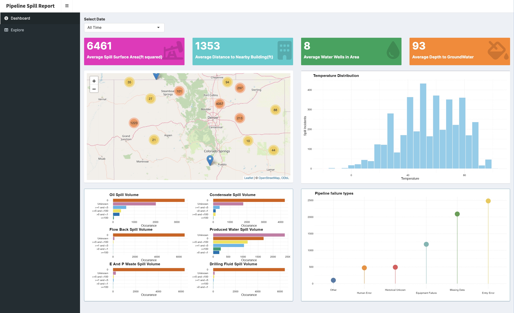

#### *DATASET*

The dataset was taken from the ECMC website [ECMC_Dataset](https://ecmc.state.co.us/data2.html#/downloads) dated (September/2023). The dataset is not well maintained and much of the columns I did not use. I ommited the markdown file I was exploring with(not well maintained and not very fruitful)

*
The helper function processes the original dataset by merging and keeping the most up to date document, and greps the temperature pattern

#### *Results*

All of my findings can be summarized into this rough dashboard. I created in R a while ago (might create one in a different software), 

   

